# Predicción de Diabetes (Clasificación)
 
---
## 📋 Abstract
This project applies deep learning to predict whether a person
has diabetes based on 21 everyday health indicators, such as
blood pressure, body mass index, physical activity and lifestyle
habits. The CDC Diabetes Health Indicators BRFSS 2015 dataset
was used, containing 70,692 records evenly split between people
with and without diabetes. Using two research papers as
reference, the original model was refined by adding extra
learning layers, data normalization with RobustScaler, and
mechanisms to prevent the model from simply memorizing the
training data, such as Batch Normalization and Dropout. The
model was trained over 50 epochs and showed stable behavior
between training and validation data. The results suggest that
it is possible to build a support tool to identify diabetes risk
using only information that anyone can provide, with no need
for clinical tests.

---

## 📃 Introducción

La diabetes es una enfermedad que cada vez afecta a más personas 
alrededor del mundo, y detectarla a tiempo puede marcar una gran 
diferencia en la calidad de vida de quien la padece. Sin embargo, 
muchas veces el diagnóstico llega tarde porque no siempre se tiene 
acceso fácil a pruebas médicas especializadas.

Este proyecto surge como una exploración de si es posible predecir 
el riesgo de diabetes usando únicamente información general de salud, 
es decir, datos que cualquier persona conoce sobre sí misma sin 
necesidad de ir a un laboratorio. Para esto se entrenó un modelo 
de deep learning con datos reales recopilados por los Centros para 
el Control y la Prevención de Enfermedades de Estados Unidos (CDC).

El modelo fue construido tomando como referencia dos artículos que 
trabajaron con el mismo conjunto de datos, lo que permitió comparar 
resultados y tomar decisiones más fundamentadas sobre el diseño y entrenamiento 
de la red.

---

## 📊 Dataset

**CDC Diabetes Health Indicators — BRFSS 2015**

- **Fuente:** Centers for Disease Control and Prevention (CDC) — Behavioral Risk Factor Surveillance System (BRFSS) 2015
- **Instancias:** 70,692
- **Features:** 21
- **Target:** `Diabetes_binary` — 0 = No diabetes, 1 = Sí diabetes
- **Balance:** 50% / 50% 

### Descripción de las columnas

| Columna | Descripción | Tipo de dato |
|---|---|---|
| `Diabetes_binary` | Si la persona tiene diabetes (1) o no (0) **(Target)**| Categórico |
| `HighBP` | Tiene presión arterial alta (1) o no (0) | Categórico |
| `HighChol` | Tiene colesterol alto (1) o no (0) | Categórico |
| `CholCheck` | Se ha revisado el colesterol en los últimos 5 años | Categórico |
| `BMI` | Índice de masa corporal | Numérico |
| `Smoker` | Ha fumado al menos 100 cigarros en su vida | Categórico |
| `Stroke` | Ha sufrido un derrame cerebral | Categórico |
| `HeartDiseaseorAttack` | Tiene enfermedad coronaria o ha tenido un infarto | Categórico |
| `PhysActivity` | Ha hecho actividad física en los últimos 30 días | Categórico |
| `Fruits` | Consume fruta al menos una vez al día | Categórico |
| `Veggies` | Consume verduras al menos una vez al día | Categórico |
| `HvyAlcoholConsump` | Consumo alto de alcohol | Categórico |
| `AnyHealthcare` | Tiene algún tipo de cobertura médica | Categórico |
| `NoDocbcCost` | No pudo ver al doctor por costo en el último año | Categórico |
| `GenHlth` | Salud general percibida (escala 1 = excelente a 5 = mala) | Numérico  |
| `MentHlth` | Días de mala salud mental en el último mes | Numérico |
| `PhysHlth` | Días de mala salud física en el último mes  | Numérico |
| `DiffWalk` | Tiene dificultad para caminar o subir escaleras | Categórico |
| `Sex` | Sexo (0 = mujer, 1 = hombre) | Categórico |
| `Age` | Rango de edad en 13 categorías | Numérico |
| `Education` | Nivel educativo (escala 1 a 6) | Numérico  |
| `Income` | Nivel de ingresos  | Numérico  |

---
## 🔬 Implementación

### Análisis Exploratorio (EDA)
 
Como primer paso se verificó el balance de clases del conjunto de datos. La distribución resultó ser equitativa, con un 50% de casos en cada categoría,  como se observa en la imagen.

```python
import matplotlib.pyplot as plt

conteo = df_diabetes['Diabetes_binary'].value_counts()


plt.figure(figsize=(6, 4))
plt.bar(['No Diabetes (0)', 'Diabetes (1)'], conteo.values, color=['blue', 'green'])
plt.title('Distribución Dataset')
plt.xlabel('Clase')
plt.ylabel('Número de instancias')
plt.tight_layout()

for i, valor in enumerate(conteo.values):
    plt.text(i, valor + 200, str(valor), ha='center', fontweight='bold')

plt.show()
```
 
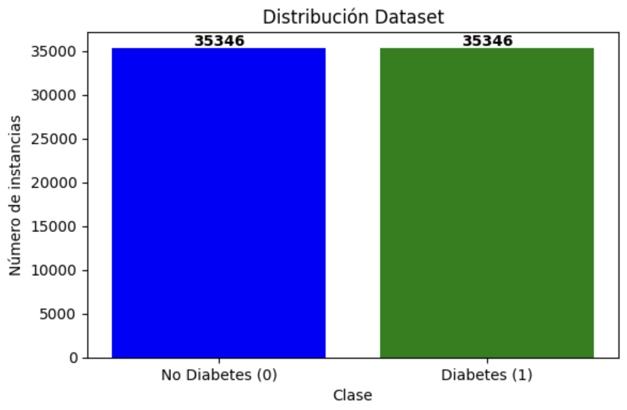
 


### Preprocesamiento

Una vez verificado el balance, los datos fueron preprocesados:

El preprocesamiento se realizó en dos etapas correspondientes al modelo base y al modelo refinado. Ambos comparten los mismos pasos iniciales, pero cambian en la técnica de normalización aplicada.

1. **Separación de features y target.** En ambas versiones se separaron las 21 columnas de indicadores de salud (X) de la columna objetivo `Diabetes_binary` (y), que indica si una 
persona tiene diabetes (1) o no (0).
```python
X = df_diabetes[['HighBP', 'HighChol', 'CholCheck', 'BMI', 'Smoker', 'Stroke',
             'HeartDiseaseorAttack', 'PhysActivity', 'Fruits', 'Veggies',
             'HvyAlcoholConsump', 'AnyHealthcare', 'NoDocbcCost', 'GenHlth',
             'MentHlth', 'PhysHlth', 'DiffWalk', 'Sex', 'Age', 'Education', 'Income']]
y_raw = df_diabetes['Diabetes_binary']
```

2. **División train/test.** El modelo experimental usó una división 80/20, que es una de las proporciones más comunes en machine learning. Para el modelo refinado se ajustó a 
70/30, alineándose con la división que Ullah, Saleem, Jamjoom et al.(*Detecting High-Risk Factors and Early Diagnosis of Diabetes Using Machine Learning Methods*, 2022) aplicaron sobre el mismo dataset, donde el 70% se destinó al entrenamiento y el 30% restante a la prueba. Adicionalmente, se reservó un 15% del conjunto de entrenamiento para 
validación durante el proceso de ajuste.


| | Modelo Experimental | Modelo Refinado |
|---|---|---|
| **Train** | 80% | 70% |
| **Test** | 20% | 30% |
| **Validación** | 10% del train | 15% del train |


```python
# Modelo base
X_train, X_test, y_train, y_test = train_test_split(
    X, y_encoded, test_size=0.2, random_state=42, stratify=y_encoded)

# Modelo refinado
X_train, X_test, y_train, y_test = train_test_split(
    X, y_encoded, test_size=0.3, random_state=42, stratify=y_encoded)
```


3. **Normalización.** El modelo experimental normaliza los datos con `StandardScaler`. En el modelo refinado se adoptó `RobustScaler`, siguiendo
directamente lo descrito por Afandi et al. [2], quienes justifican este cambio porque los datos de salud
frecuentemente contienen valores atípicos, como registros extremos de BMI o días de mala salud y `RobustScaler` maneja mejor esas variaciones al no verse afectado por 
valores muy alejados del promedio.


| | Modelo Experimental | Modelo Refinado |
|---|---|---|
| **Scaler** | `StandardScaler` | `RobustScaler` |
| **Cómo funciona** | Centra los datos en media 0 | Usa la mediana y el rango intercuartílico |


```python
# Modelo base
scaler = StandardScaler()
X_train_scaled = scaler.fit_transform(X_train)
X_test_scaled  = scaler.transform(X_test)

# Modelo refinado
scaler = RobustScaler()
X_train_scaled = scaler.fit_transform(X_train)
X_test_scaled  = scaler.transform(X_test)
```


## Modelo

1. **Arquitectura de la red neuronal.**

| | Modelo experimental | Modelo Refinado |
|---|---|---|
| **Capas ocultas** | 1 (256 neuronas) | 3 (256 → 128 → 64 neuronas) |
| **Activación** | ReLU + Sigmoid | ReLU + Sigmoid |
| **Batch Normalization** | No | Sí (capas 1 y 2) |
| **Dropout** | No | 0.3, 0.3, 0.2 |

El modelo experimental fue una red con una sola capa oculta de 256 neuronas con activación ReLU, seguida directamente de la capa de salida con activación sigmoid. 
Se eligió sigmoid en la salida porque el problema es de clasificación binaria. Esta arquitectura sirvió como punto de partida para entender el comportamiento 
del modelo con el dataset.

```python
# Modelo base
model = models.Sequential()
model.add(layers.Input(shape=(21,)))
model.add(layers.Dense(256, activation='relu'))
model.add(layers.Dense(1, activation='sigmoid'))
```
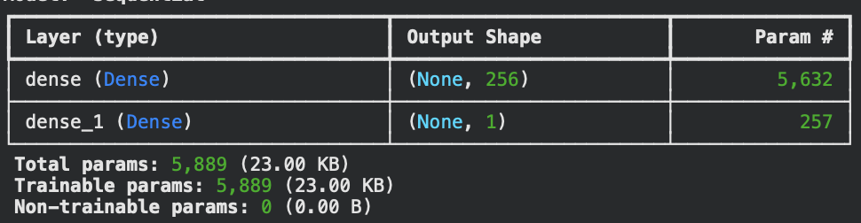

Para el modelo refinado se amplió la arquitectura a tres capas ocultas de 256, 128 y 64 neuronas. Este diseño de capas sigue la estructura propuesta por Afandi et al. [2], donde capas sucesivas de menor tamaño permiten al modelo extraer patrones cada vez más específicos a medida que la información avanza por la red.

Se agregó Batch Normalization después de las dos primeras capas. Esta técnica normaliza los valores internos entre capa y capa durante el entrenamiento, lo que evita que los valores se disparen o se vuelvan muy pequeños, haciendo que el modelo aprenda de forma más estable y rápida.

Se incorporó también Dropout con valores de 0.3 en las primeras dos capas y 0.2 en la tercera, tomando como referencia los valores usados por Ullah et al. [1]. El Dropout desactiva aleatoriamente un porcentaje de neuronas en cada paso del entrenamiento, lo que obliga al modelo a no depender de conexiones específicas y reduce el riesgo de que memorice los datos de entrenamiento en lugar de aprender patrones generales.

```python
# Modelo refinado
model = models.Sequential()
model.add(layers.Input(shape=(21,)))

model.add(layers.Dense(256, activation='relu'))
model.add(layers.BatchNormalization())
model.add(layers.Dropout(0.3))

model.add(layers.Dense(128, activation='relu'))
model.add(layers.BatchNormalization())
model.add(layers.Dropout(0.3))

model.add(layers.Dense(64, activation='relu'))
model.add(layers.Dropout(0.2))

model.add(layers.Dense(1, activation='sigmoid'))
```
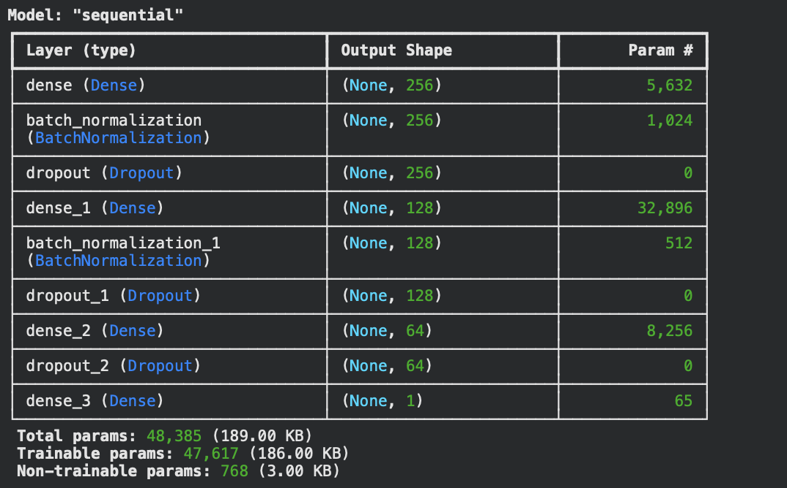

1. **Compilación.**


| | Modelo Experimental | Modelo Refinado |
|---|---|---|
| **Optimizador** | Adam (lr = 2e-5) | Adam (lr = 1e-3) |
| **Loss** | Binary Crossentropy | Binary Crossentropy |
| **Métricas** | Accuracy, Precision, Recall | Accuracy, Precision, Recall |

En ambos modelos se usó binary_crossentropy como función de pérdida por ser la estándar para problemas de clasificación binaria, y las mismas tres métricas que reportan los dos artículos de referencia, lo que permite una comparación directa con sus resultados.

La diferencia principal está en el learning rate del optimizador Adam. El modelo base usó un valor de 2e-5. En el modelo refinado 
se subió a 1e-3, que es el valor predeterminado y más ampliamente 
recomendado para Adam. Afandi et al. [2] usaron una tasa 
de aprendizaje entre 1e-4 y 1e-3, por eso decidí cambiarlo a ese valor.

```python
# Modelo base
model.compile(
    loss='binary_crossentropy',
    optimizer=optimizers.Adam(learning_rate=2e-5),
    metrics=['acc', 'precision', 'recall']
)

# Modelo refinado
model.compile(
    loss='binary_crossentropy',
    optimizer=optimizers.Adam(learning_rate=1e-3),
    metrics=['acc', 'precision', 'recall']
)
```


1. **Épocas, Batch Size y Validación.**


| | Modelo Base | Modelo Refinado |
|---|---|---|
| **Épocas** | 10 | 50 |
| **Batch Size** | 32 | 64 |
| **Validation Split** | 10% | 15% |
| **Callbacks** | ModelCheckpoint | ModelCheckpoint |

El modelo experimental se entrenó durante 10 épocas. Como se puede observar en las gráficas, las curvas de accuracy y loss se 
mantuvieron muy cercanas entre sí desde la primera época y prácticamente no cambiaron a lo largo del entrenamiento. Esto indica 
que las 10 épocas fueron suficientes para estabilizarse, pero no para mejorar.

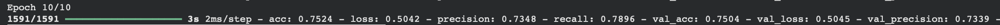
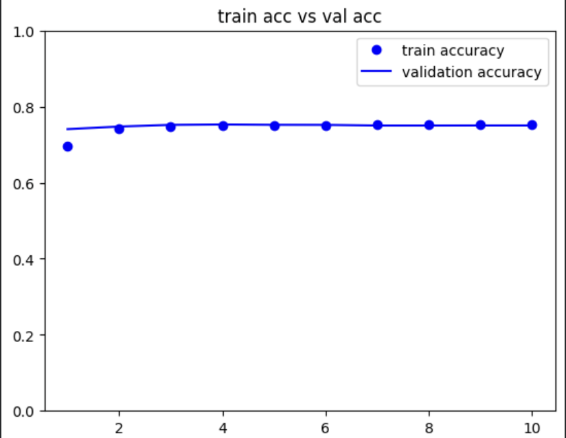


Para el modelo refinado se aumentó a 50 épocas siguiendo como referencia el artículo de Afandi et al. [2] , quienes entrenaron con ese mismo límite 
aplicando early stopping para detener el proceso cuando el modelo dejara de mejorar. El batch size se ajustó de 32 a 64, lo que procesa más ejemplos por paso y 
genera estimaciones más estables durante el entrenamiento. El porcentaje de validación se subió de 10% a 15% para tener una evaluación más representativa del 
comportamiento del modelo en cada época.

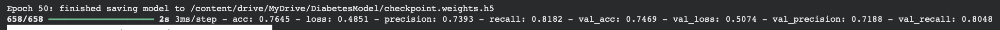
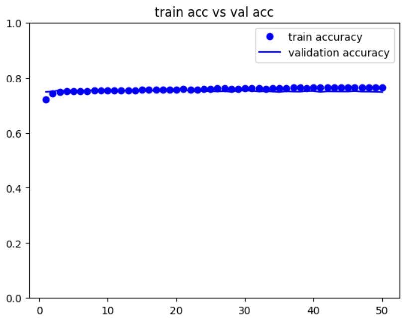
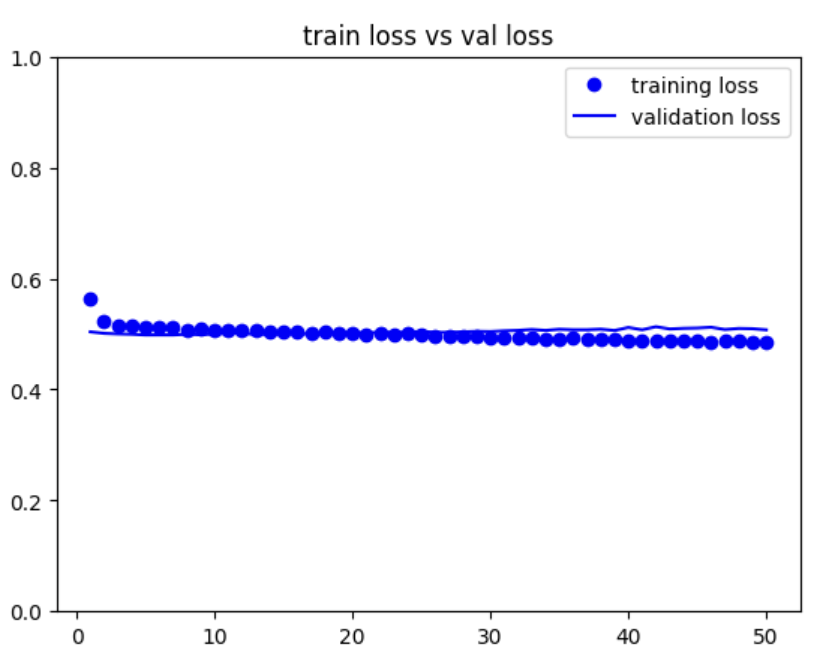


```python
# Modelo base
history = model.fit(X_train_scaled, y_train,
            epochs=10,
            validation_split=0.10,
            batch_size=32,
            callbacks=[checkpoint])

# Modelo refinado
history = model.fit(X_train_scaled, y_train,
            epochs=50,
            validation_split=0.15,
            batch_size=64,
            callbacks=[checkpoint])
```

 ---

 
###  📊 Resultados

 
Un aspecto clave que diferencia este proyecto de los artículos de referencia es la versión del dataset utilizada.
 
| | Ullah et al. [1] | Afandi et al. [2] | Este proyecto |
|---|---|---|---|
| **Dataset** | BRFSS 2015 completo | CDC Health Indicators | BRFSS 2015 balanceado |
| **Instancias** | 253,680 | 253,680 | 70,692 |
| **Balance de clases** | 86.07% / 13.93% (desbalanceado) | Desbalanceado | 50% / 50% |
| **Técnica de balance** | Sin balance | Sin balance | Ya balanceado de origen |

1. **Comparación de Métricas con los Artículos de Referencia.**
 
| Modelo / Estudio | Dataset | Accuracy | Precisión | Recall |
|---|---|---|---|---|
| Ullah et al. [1] — KNN | BRFSS 2015 (desbalanceado + SMOTE-ENN) | 98.36% | 0.98 | 0.98 |
| Afandi et al. [2] — ANN (MLP) | CDC Health Indicators (desbalanceado) | 86.45% | 85.20% | 82.70% |
| **Mi proyecto -  Modelo Base** | **BRFSS 2015 (50/50 balanceado)** | **75.3%** | **73.4%** | **79.2%** |
| **Mi proyecto — Modelo Refinado** | **BRFSS 2015 (50/50 balanceado)** | **76.4%** | **73.9%** | **81.8%** |
 
> Las métricas de los papers son más altas principalmente porque sus datasets estaban desbalanceados o fueron ampliados con SMOTE-ENN, lo que facilita la separación de clases. Este proyecto parte de una distribución real y equitativa.


2. **Matrices de Confusión.**
 
#### Modelo Base
 
<p align="center">
  
</p>


Del total de personas que sí tenían diabetes, el modelo las identificó correctamente el 81% de las veces. Del total de personas que **no tenían diabetes**, las clasificó correctamente el 68% de las veces. Esto significa que el modelo base era más hábil detectando diabéticos que descartando personas sanas.
 
#### Modelo Refinado
 
<p align="center">
  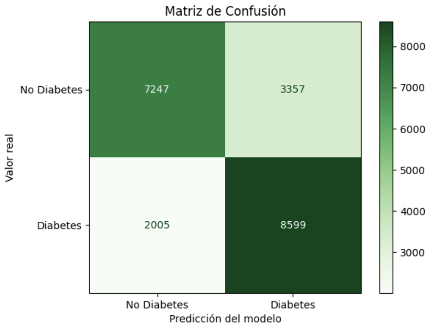
</p>

 
Del total de personas que sí tenían diabetes, el modelo las identificó correctamente el 78% de las veces. Del total de personas que **no tenían diabetes, las clasificó correctamente el 71% de las veces. Comparado con el modelo base, mejoró su capacidad para descartar correctamente a personas sanas, a cambio de una reducción en la detección de diabéticos. 

3. **Predicciones Individuales.**
 
#### Modelo Base
<p align="center">
  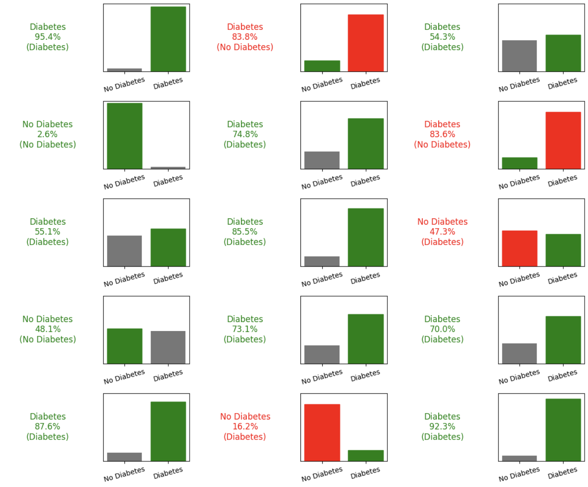
</p>

#### Modelo Refinado
<p align="center">
  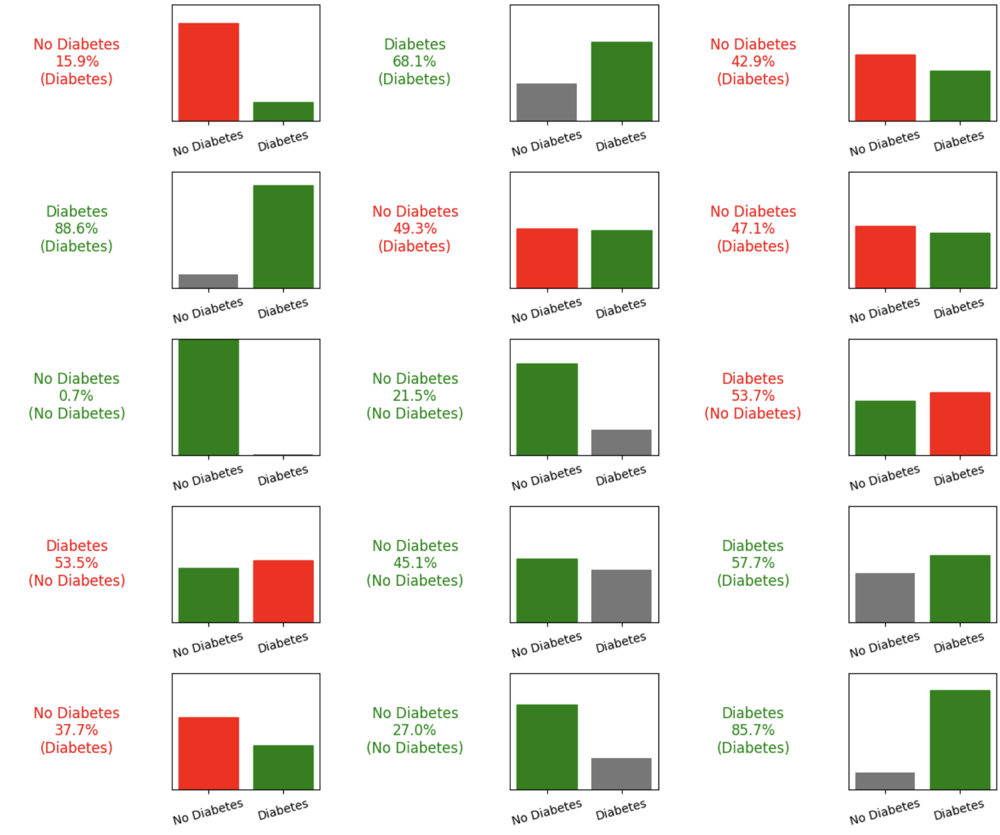
</p>
El modelo base tiende a producir predicciones con mayor confianza extrema (95%, 83%), tanto en aciertos como en errores. El modelo refinado, gracias al Dropout y Batch Normalization, genera probabilidades más moderadas, lo que refleja una mejor calibración: es menos propenso a estar muy equivocado con alta confianza.


#### ¿Por qué no se supera el 76% de accuracy?

La accuracy se estabiliza en torno al 74–76%:
 
1. **Dataset balanceado.** Con 50/50 de clases, no existe una clase dominante que el modelo pueda aprovechar.
2. **Convergencia prematura.** Las curvas de accuracy muestran que ambos modelos alcanzaron su punto de estabilización muy rápido. A más épocas, la curva se aplana sin mejorar, lo que indica que el límite no está en el entrenamiento sino en la información disponible en los features.
4. **Diferencia metodológica con los papers.** Ullah et al. generaron datos con SMOTE-ENN, ampliando el espacio de decisión. Afandi et al. entrenaron con el dataset donde el 86% pertencia a un valor de la clase.

 
 
---

 
###  Conclusiones

Este proyecto tenía como objetivo predecir si una persona tiene diabetes o no, tomando como referecia el dataset "CDC Diabetes Health Indicators". Logrando clasificar correctamente alrededor del 75% de los casos.
Sin embargo, una de las cosas que más me llamó la atención durante el desarrollo fue que sin importar cuánto se ajustaran los hiperparámetros, el accuracy no subía de ese rango. Se probaron distintas configuraciones tomadas directamente de los dos artículos de referencia, como cambiar el scaler de StandardScaler a RobustScaler, aumentar las capas ocultas de una a tres, agregar Batch Normalization y Dropout, subir el learning rate de 2e-5 a 1e-3, entrenar durante 50 épocas en lugar de 10 y ajustar la división del dataset a 70/30. Todos estos cambios mejoraron la estabilidad del entrenamiento y equilibraron mejor los errores entre las dos clases, pero la accuracy global se mantuvo prácticamente igual.
La conclusión a la que llegué es que el límite no está en el modelo sino en los datos. Los 21 features disponibles son indicadores de riesgo, es decir, que saber que alguien tiene presión alta, un IMC elevado o que no hace ejercicio aumenta la probabilidad de diabetes, pero no la determina. Hay personas con todos esos factores que no tienen diabetes y personas sin ninguno que sí la tienen. Esa superposición entre clases es algo que complica que la arquitectura de red neuronal puede predecir.
Si pudiera repetir el proyecto, consideraría explorar features adicionales como antecedentes familiares, que sí tienen un poder predictivo más directo. También sería bueno probar arquitecturas más complejas o técnicas como SMOTE para generar datos, tal como hicieron en Ullah et al., aunque eso implicaría trabajar con el dataset desbalanceado y los resultados ya no serían directamente comparables.

---

 ## 📖 Referencias
[1] Ullah, Z., Saleem, F., Jamjoom, M., Fakieh, B., Kateb, F., Marish Ali, A., & Shah, B. (2022). Detecting High-Risk Factors and Early Diagnosis of Diabetes Using Machine Learning Methods. *Computational Intelligence and Neuroscience*, 2022, Article ID 2557795.
 
[2] Afandi, M., Riskianto, D. D., Ramadhan, M. R., & Sudriyanto. (2026). Analisis Prediksi Diabetes Berbasis Artificial Neural Network Menggunakan Data CDC Diabetes Health Indicators. *Jurnal Riset Sistem dan Tecnología Informasi (RESTIA)*, 4(1), 22–29.

[3] A. Teboul, "Diabetes Health Indicators Dataset," Kaggle, 2021. [Online]. Available: https://www.kaggle.com/datasets/alexteboul/diabetes-health-indicators-dataset/data


