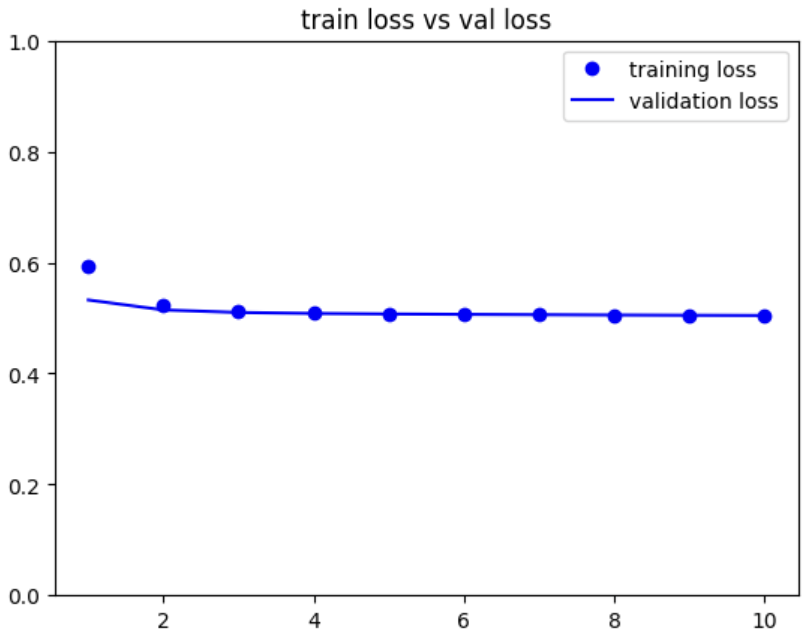
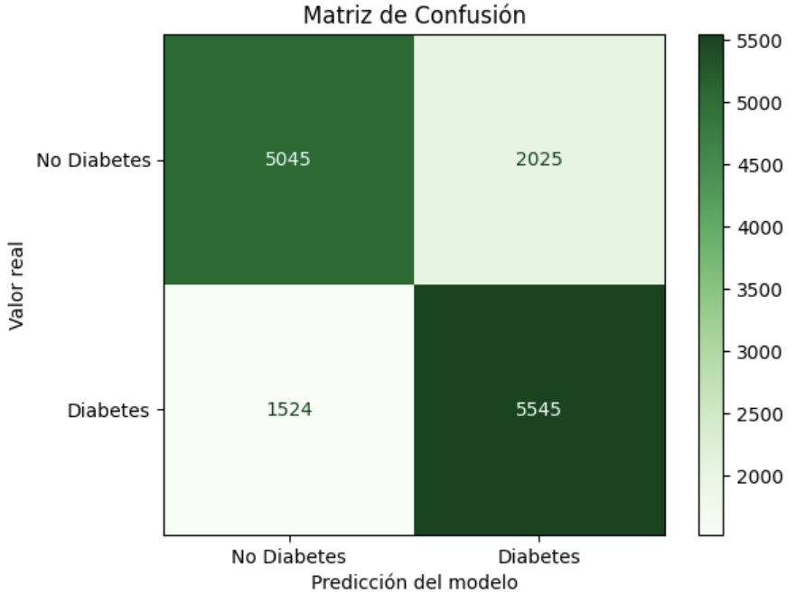

# Predicción de Diabetes (Clasificación)
 
---
## 📊 Dataset

**CDC Diabetes Health Indicators — BRFSS 2015**

- **Fuente:** Centers for Disease Control and Prevention (CDC) — Behavioral Risk Factor Surveillance System (BRFSS) 2015
- **Instancias:** 70,692
- **Features:** 21
- **Target:** `Diabetes_binary` — 0 = No diabetes, 1 = Sí diabetes
- **Balance:** 50% / 50% 

### Descripción de las columnas

| Columna | Descripción | Tipo de dato |
|---|---|---|
| `Diabetes_binary` | Si la persona tiene diabetes (1) o no (0) **(Target)**| Categórico |
| `HighBP` | Tiene presión arterial alta (1) o no (0) | Categórico |
| `HighChol` | Tiene colesterol alto (1) o no (0) | Categórico |
| `CholCheck` | Se ha revisado el colesterol en los últimos 5 años | Categórico |
| `BMI` | Índice de masa corporal | Numérico |
| `Smoker` | Ha fumado al menos 100 cigarros en su vida | Categórico |
| `Stroke` | Ha sufrido un derrame cerebral | Categórico |
| `HeartDiseaseorAttack` | Tiene enfermedad coronaria o ha tenido un infarto | Categórico |
| `PhysActivity` | Ha hecho actividad física en los últimos 30 días | Categórico |
| `Fruits` | Consume fruta al menos una vez al día | Categórico |
| `Veggies` | Consume verduras al menos una vez al día | Categórico |
| `HvyAlcoholConsump` | Consumo alto de alcohol | Categórico |
| `AnyHealthcare` | Tiene algún tipo de cobertura médica | Categórico |
| `NoDocbcCost` | No pudo ver al doctor por costo en el último año | Categórico |
| `GenHlth` | Salud general percibida (escala 1 = excelente a 5 = mala) | Numérico  |
| `MentHlth` | Días de mala salud mental en el último mes | Numérico |
| `PhysHlth` | Días de mala salud física en el último mes  | Numérico |
| `DiffWalk` | Tiene dificultad para caminar o subir escaleras | Categórico |
| `Sex` | Sexo (0 = mujer, 1 = hombre) | Categórico |
| `Age` | Rango de edad en 13 categorías | Numérico |
| `Education` | Nivel educativo (escala 1 a 6) | Numérico  |
| `Income` | Nivel de ingresos  | Numérico  |

---
## 🔬 Implementación

### Análisis Exploratorio (EDA)
 
Como primer paso se verificó el balance de clases del conjunto de datos. La distribución resultó ser equitativa, con un 50% de casos en cada categoría,  como se observa en la imagen.

```python
import matplotlib.pyplot as plt

conteo = df_diabetes['Diabetes_binary'].value_counts()


plt.figure(figsize=(6, 4))
plt.bar(['No Diabetes (0)', 'Diabetes (1)'], conteo.values, color=['blue', 'green'])
plt.title('Distribución Dataset')
plt.xlabel('Clase')
plt.ylabel('Número de instancias')
plt.tight_layout()

for i, valor in enumerate(conteo.values):
    plt.text(i, valor + 200, str(valor), ha='center', fontweight='bold')

plt.show()
```
 

 


### Preprocesamiento

Una vez verificado el balance, los datos fueron preprocesados:

1. **Separación de features y target.** Se separaron las 21 columnas con valores para predecir (X) de la columna objetivo `Diabetes_binary` (y).
```python
X = df_diabetes[['HighBP', 'HighChol', 'CholCheck', 'BMI', 'Smoker', 'Stroke',
             'HeartDiseaseorAttack', 'PhysActivity', 'Fruits', 'Veggies',
             'HvyAlcoholConsump', 'AnyHealthcare', 'NoDocbcCost', 'GenHlth',
             'MentHlth', 'PhysHlth', 'DiffWalk', 'Sex', 'Age', 'Education', 'Income']]
y_raw = df_diabetes['Diabetes_binary']
```

2. **División train/test.** Se eligió una división de 80% para Train y 20% para Test (Considerando en un futuro implementar un 10% para validación) por ser una de las proporciones más usadas en machine learning.
```python
X_train, X_test, y_train, y_test = train_test_split(X, y_encoded, test_size=0.2, random_state=42, stratify=y_encoded)
```

## Modelo

Se construyó una red neuronal con la API de Keras, compuesta por una capa de entrada para las 21 features, una capa oculta de 256 neuronas con función de activación Relu y una capa de salida con una función de activación sigmoid, debido a que nuestro reto se centra en clasificación. Para la evaluación del modelo se emplearon tres métricas (Accuracy, Precision y Recall) fueron seleccionadas debido a que se calculan en el artículo de referencia, esto con el fin de contar con un punto de comparación para los resultados obtenidos.

```python
from tensorflow.keras import optimizers
from tensorflow.keras import models
from tensorflow.keras import layers

model = models.Sequential()
#Entrance X
model.add(layers.Input(shape=(21,)))
model.add(layers.Dense(256,activation='relu'))
#model.add(layers.Dense(128,activation='relu'))

#Sigmoid as activation function for classification
model.add(layers.Dense(1,activation='sigmoid'))

model.summary()

model.compile(loss='binary_crossentropy',
						optimizer=optimizers.Adam(learning_rate=2e-5),
						metrics=['acc','precision','recall'])
```


### Resultados

El modelo fue entrenado durante 10 épocas. Posteriormente se graficaron las métricas de accuracy y loss correspondientes tanto al conjunto de entrenamiento como al de validación.
El modelo alcanzó un accuracy aproximado del 75%. Las curvas de entrenamiento y validación se mantienen muy próximas entre sí a lo largo de las épocas, lo que indica que no se presentó overfitting y underfitting.


 


#### Matriz de confusión

La matriz de confusión evidencia que el modelo clasifica correctamente la mayoría de los casos, manteniendo un equilibrio entre la detección de personas con diabetes y aquellas que no la presentan.
De las personas sin diabetes, el modelo identificó correctamente 5,045 casos, mientras que clasificó erróneamente 2,025 como diabéticas. Por otro lado, de las personas con diabetes, acertó en 5,545 casos y 1,524 los clasificó incorrectamente como sanas. En conjunto, el modelo clasifica correctamente gran parte de los casos (10,590 de 14,139)


 


 ---
## 📁 Estructura del repositorio
 
```
├── Codigo/
│   └── Codigo.ipynb
├── Dataset/
│   └── diabetes_binary_5050split_health_indicators_BRFSS2015.csv
├── Paper/
│   └── Original
│       └── BRFSS2015_paper.pdf
├── Imagenes/
└── README.md
```
---
 ## 📖 Referencias

[1] A. Teboul, "Diabetes Health Indicators Dataset," Kaggle, 2021. [Online]. Available: https://www.kaggle.com/datasets/alexteboul/diabetes-health-indicators-dataset/data

[2] Centers for Disease Control and Prevention, "Behavioral Risk Factor Surveillance System Survey Data," U.S. Department of Health and Human Services, Atlanta, GA, 2015.

[3] M. Afandi, D. D. Riskianto, M. R. Ramadhan, and Sudriyanto, "Artificial Neural Network-Based Diabetes Prediction Analysis Using CDC Diabetes Health Indicators Data," Jurnal Riset Sistem dan Teknologi Informasi (RESTIA), vol. 4, no. 1, pp. 22–29, Feb. 2026.


